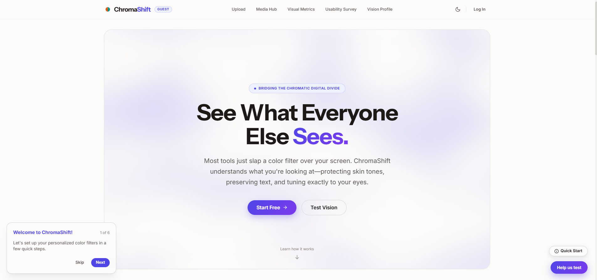
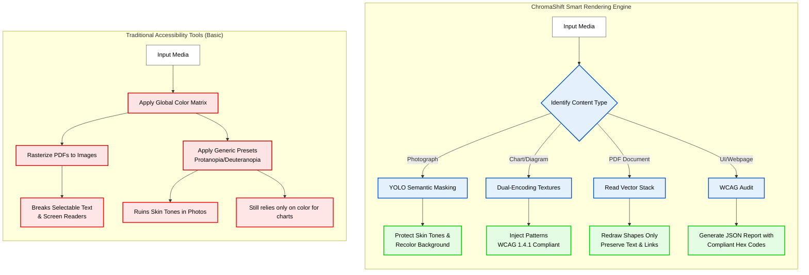

# ChromaShift

> **Empowering the chromatic digital divide.** Beyond Basic Filters. Truly Smart Colorblind Accessibility for the 300 million individuals living with Color Vision Deficiency (CVD).

**🔗 Live Preview:** <a href="https://chromashift-py.vercel.app/" target="_blank">chromashift-py.vercel.app</a>

*(Try it instantly! The live demo includes pre-loaded sample images so you can test the daltonization effect in one click without creating an account or uploading your own photos.)*

<div align="center">
  </img>
</div>

## The Problem: Basic Filters
Standard accessibility tools treat everyone the same. They apply rigid, generic color filters (like "Protanopia" or "Deuteranopia" presets) across the entire screen. This often distorts natural lighting, ruins skin tones in photographs, breaks selectable text in PDFs, and relies purely on color to differentiate charts.

## The Solution: Smart Rendering
ChromaShift introduces a **content-aware rendering engine**. It calibrates to your specific eyes and understands what you're looking at. By leveraging lightweight machine learning, it treats a photograph, a bar chart, and a text document exactly how they should be treated.

## Key Features & User Benefits

- **Protects Natural Skin Tones**: While other filters turn faces green or grey, our YOLO semantic masking engine detects people and animals. It dynamically corrects the background while leaving skin tones natural.
  <br/>
  
- **Smart Charts & Graphs (WCAG 1.4.1 Compliant)**: Color isn't enough. ChromaShift detects discrete graphics and automatically injects physical textures (like dots or stripes) into charts, making data easy to read without guessing.
  <br/>
  
- **Non-Destructive PDF Vectors**: Unlike tools that rasterize documents into massive images, ChromaShift redraws vector paths in the background. Your text remains selectable, hyperlinks stay active, and screen readers continue to work perfectly.
  <br/>
  
- **Flicker-Free Video**: Enjoy smooth, color-corrected videos without the flashing and jittering caused by basic accessibility tools, thanks to Optical Flow and Temporal Smoothing.
  <br/>
  </img>
- **Actionable WCAG Audits**: Don't just find out you failed an audit. ChromaShift generates detailed JSON reports with the exact, calculated hex codes developers need to fix contrast issues.
- **Personalized Vision Calibration**: A quick interactive wizard tunes the screen to your specific eyes, rather than forcing you into a generic category.

---

## How it Works (The Workflow)

ChromaShift intelligently routes media based on its structural content to provide the optimal reading experience:



## The Core Engine (The Technology)

Under the hood, ChromaShift goes far beyond basic CSS `filter: hue-rotate()`. It uses legitimate, physiologically-based computer vision tensor math mixed with AI semantic segmentation.

```mermaid
flowchart TD
    %% Styling
    classDef math fill:#f9f9f9,stroke:#333,stroke-width:2px,color:#000
    classDef color fill:#e1bee7,stroke:#8e24aa,stroke-width:2px,color:#000
    classDef ai fill:#c8e6c9,stroke:#388e3c,stroke-width:2px,color:#000

    subgraph ChromaShift Core Daltonization Engine
        A[Original Image sRGB]:::color --> B[Linearize & Remove Gamma]:::math
        B --> C[Transform to LMS Space<br/>Physiological Cone Simulation]:::math
        
        C --> D[Apply Personal Blindness Matrix<br/>Simulates Damaged Cone Response]:::math
        
        C --> E(( Subtract )):::math
        D --> E
        
        E --> F[Extract 'Error' Matrix<br/>Invisible Color Data]:::math
        
        G[YOLOv8-Seg Model]:::ai --> H[Generate Semantic Mask<br/>Protect Skin/Faces]:::ai
        
        F --> I(( Tensor Multiply )):::math
        H --> I
        
        I --> J[Error-to-Modulation Matrix<br/>Shift into Visible Wavelengths]:::math
        
        J --> K[Recombine & Convert to LAB Space]:::color
        K --> L[CLAHE & Unsharp Mask<br/>on Lightness Channel Only]:::math
        L --> M[Final Output sRGB]:::color
    end
```



## Tech Stack

### Frontend
- **Framework**: React 18 + TypeScript
- **Styling**: Custom CSS Design Tokens + Native Variables + Framer Motion
- **AI Runtime**: TensorFlow.js (WebGL daltonization) + ONNX Runtime Web (YOLO26n-seg via Hugging Face `peiyan2/cvd-onnx-models`)

### Backend
- **Framework**: Python FastAPI (Async)
- **Database**: PostgreSQL (SQLAlchemy) + Redis (Caching)
- **Storage**: S3-compatible (MinIO)
- **Media Processing**: OpenCV + FFmpeg + ONNX Runtime

## Getting Started (Local Development)

### Prerequisites
- [Docker & Docker Compose](https://www.docker.com/products/docker-desktop/)
- [Node.js v20+](https://nodejs.org/)
- [Python 3.12+ & Poetry](https://python-poetry.org/)

### Run Locally with Docker
For local development and testing, we use Docker to instantly spin up the required infrastructure (PostgreSQL, Redis, MinIO).

1. **Clone the repository**:
   ```bash
   git clone https://github.com/peiyan0/ChromaShift.git
   cd ChromaShift
   ```

2. **Start the containers**:
   ```bash
   docker compose up -d
   ```

3. **Access the platform**:
   - **Frontend**: `http://localhost` (Port 80)
   - **Backend API**: `http://localhost:8000`
   - **Swagger UI**: `http://localhost:8000/docs`

## License

This project is licensed under the MIT License.
